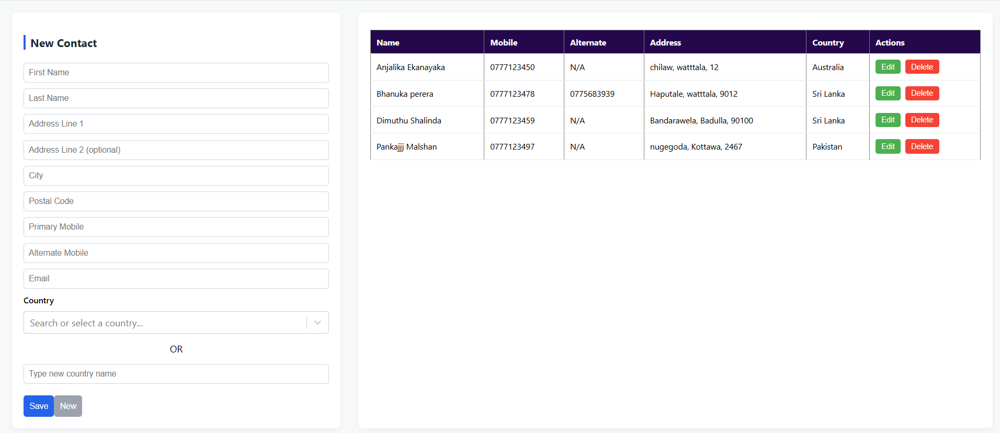

# 🌐 MERN Contact Management System

A **full-stack MERN (MongoDB, Express, React, Node.js)** web application that enables users to manage their contacts efficiently with complete **CRUD (Create, Read, Update, Delete)** operations.

The system features **dynamic country management**, real-time form validation, and a clean, responsive UI — all powered by **MongoDB Atlas**.

---

## 📸 Application UI



---

## 📁 Project Folder Structure

```bash
MernContactApp/
│
├── backend/                   # Node.js + Express + MongoDB backend
│   ├── controllers/            # Business logic for contacts & countries
│   ├── models/                 # Mongoose schemas
│   ├── routes/                 # API route handlers
│   ├── server.js               # Entry point for backend
│   ├── package.json            # Backend dependencies
│   └── .env                    # Environment variables (Mongo URI)
│
├── frontend/                  # React frontend (user interface)
│   ├── src/
│   │   ├── api/                # Axios API calls
│   │   ├── components/         # Reusable UI components (Form, List)
│   │   ├── App.js              # Root component
│   │   ├── App.css             # Styling
│   │   └── index.js            # React entry point
│   ├── public/
│   └── package.json            # Frontend dependencies
│
└── ss/                        # Screenshots and visuals
    └── UI.png
⚙️ Technologies Used
🖥️ Frontend
React.js

Axios

HTML5 / CSS3

JavaScript (ES6)

⚙️ Backend
Node.js

Express.js

Mongoose

dotenv

CORS

MongoDB Atlas (Cloud Database)

🚀 Features
✅ Add, update, and delete contacts
✅ Inline validation for required fields
✅ Support for multiple phone numbers (Home, Work, Alternate)
✅ Dynamically add new countries directly from the form
✅ Fetch and display existing countries from MongoDB
✅ Responsive, modern UI with smooth user experience

🧩 Environment Variables
Create a .env file inside the backend folder and add:

env
Copy code
PORT=5000
MONGO_URI=your_mongodb_atlas_connection_string
🧭 How to Run the Project Locally
1️⃣ Clone the Repository
bash
Copy code
git clone https://github.com/your-username/MernContactApp.git
cd MernContactApp
2️⃣ Start the Backend
bash
Copy code
cd backend
npm install
npx nodemon server.js
Runs at → http://localhost:5000

3️⃣ Start the Frontend
Open another terminal:

bash
Copy code
cd frontend
npm install
npm start
Runs at → http://localhost:3000

🧪 API Endpoints (for Postman Testing)
Method	Endpoint	Description
GET	/api/countries	Fetch all countries
POST	/api/countries	Add a new country
GET	/api/contacts	Fetch all contacts
POST	/api/contacts	Add a new contact
PUT	/api/contacts/:id	Update a contact
DELETE	/api/contacts/:id	Delete a contact

🧠 Developer
👨‍💻 Name: Dimuthu Shalinda
🎓 University: University of Jaffna – Faculty of Engineering
🏫 Department: Computer Engineering